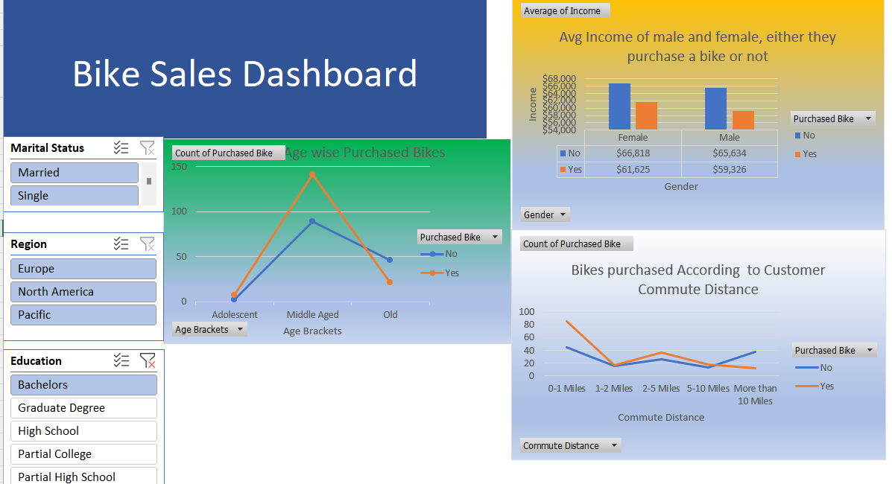

# 🚲 Bike Sales Analysis – Excel Dashboard Project

This project involves creating an interactive Excel dashboard to analyze customer demographics and lifestyle factors influencing bike purchasing behavior. The dataset was sourced from [Kaggle - Bike Buyers Dataset](https://www.kaggle.com/datasets/heeraldedhia/bike-buyers).

---

## 📁 Files Included

- `bike_sales_dashboard.xlsx` – Main Excel file with dashboard and supporting sheets  
- `data_description.txt` – Breakdown of dataset columns  
- `insights.txt` – Written summary of dashboard findings  

---

## 🛠️ Tools Used

- Microsoft Excel  
  - Pivot Tables  
  - Slicers for segmentation  
  - Column charts and line graphs  

---

## 📊 Dashboard Features

- Age-wise purchase trend analysis  
- Gender-based income and purchase insights  
- Commute distance vs purchase rate patterns  
- Interactive slicers: Marital Status, Region, Education, and Gender  

---

## 📄 Dataset Overview

**Source:** [Kaggle – Bike Buyers Dataset](https://www.kaggle.com/datasets/heeraldedhia/bike-buyers)

This dataset includes demographic, lifestyle, and purchase behavior data of potential bike buyers.

**Columns:**
- `ID`: Unique customer identifier  
- `Marital Status`: Single / Married  
- `Gender`: Male / Female  
- `Income`: Annual income  
- `Children`: Number of children  
- `Education`: Education level  
- `Occupation`: Job title or category  
- `Home Owner`: Yes / No  
- `Cars`: Number of cars owned  
- `Commute Distance`: Commute length  
- `Region`: Region of residence  
- `Age`: Age of customer  
- `Purchased Bike`: Yes / No  

---

## 🔍 Key Insights

### 1. Age-Based Trend  
Middle-aged customers are the highest bike purchasers. Purchases dip sharply among both adolescents and older individuals.

### 2. Income vs Purchase  
Interestingly, customers who didn’t purchase a bike had a higher average income. This suggests that high earners may prefer other transport modes or value propositions.

### 3. Gender Comparison  
Although average incomes are similar, males showed a slightly higher tendency to purchase bikes.

### 4. Commute Distance Influence  
The highest rate of bike purchases occurred in customers who commute **0–1 miles**. The likelihood drops as distance increases.

### 5. Segmented Exploration  
With Excel slicers, users can segment trends by Region, Education, Marital Status, and Gender for tailored insights.

---

## 📸 Dashboard Preview

---

## ✅ Use Case

This dashboard helps marketing teams and business analysts identify potential customer segments for bike promotions and tailor sales strategies based on lifestyle patterns.
